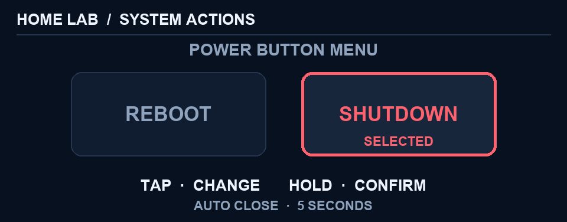

# HOME LAB

An interactive Linux/Proxmox dashboard for the built-in LCD and fingerprint
sensor of the AOOSTAR GEM12+ Pro mini PC.

> [!WARNING]
> Experimental hardware-facing software. It changes display, fingerprint,
> ACPI power-button and system-service behavior. **Use entirely at your own
> risk.** Read [DISCLAIMER.md](DISCLAIMER.md) before building or deploying it.

> [!NOTE]
> HOME LAB is a disclosed **human–AI collaborative creation**. Product intent,
> interaction design and real-device validation are human-led; implementation
> and documentation were developed with AI assistance and human review. See
> [AI_DISCLOSURE.md](AI_DISCLOSURE.md).

The project turns otherwise underused hardware into a local headless-server
console. It presents live health, compute, storage, network and service state.
The fingerprint reader is used only as a touch controller—tap for next, hold for
details/back—and does not extract or store biometric templates.


<details>
<summary>Dashboard gallery</summary>


| Internal NVMe details | External USB4/NVMe details |
| --- | --- |
|  |  |


</details>

<details>
<summary>Health-state examples</summary>

| Warning | Error — pulsing dot |
| --- | --- |
|  |  |

</details>

## Highlights

- Health, Compute, adaptive Storage, Network and Services panels.
- Compact OK/Warn/Err states with a slowly pulsing red error dot.
- NVMe SMART temperature, wear, bytes written, hours, available/capacity and
  media-error information.
- Dynamic storage cards without placeholders for absent devices.
- Persistent, low-latency tap/hold input through a patched libfprint driver.
- Guarded physical power-button menu with explicit confirmation and timeout.
- Reproducible build from pinned upstream commits; no universal installer.
- Simulator fixtures and distribution smoke tests.

## Interaction

| Input | Result |
| --- | --- |
| Sensor tap (`<400 ms`) | Next panel on the current level |
| Sensor hold (`≥400 ms`) | Enter details or return to overview |
| Physical Power tap | Open private System Actions menu |
| Sensor tap in menu | Toggle Reboot / Shutdown |
| Sensor hold in menu | Confirm selection |
| Five seconds without input | Cancel and restore previous panel |

Compact Health states preserve card space: `✓ OK`, a fixed amber `● Warn`, and
red `Err` with a slowly blinking dot.

## Architecture

```text
Linux / Proxmox metrics ─► sensor files ─► patched asterctl ─► 960×376 LCD
                                                ▲
patched libfprint ─► touch helper ─► triggers ───┤
ACPI Power event ─► guarded action helper ───────┘
```

Read [Architecture](docs/architecture.md), [System Actions](docs/system-actions.md)
and [Privacy and security](docs/security.md).

### Guarded power menu

| Reboot selected | Shutdown selected |
| --- | --- |
|  |  |

## Tested platform

- AOOSTAR GEM12+ Pro, AMD Ryzen 7 PRO 8845HS
- Proxmox VE 9.2.2 / Debian, Linux `7.0.2-6-pve`
- LCD UART `0416:90a1`
- Microarray MAFP reader `3274:8012`
- Internal NVMe plus external Corsair EX400U in native USB4/NVMe mode

This is the verified reference, not a claim of compatibility with every Linux
distribution or AOOSTAR model.

## Reproducible build

The build writes only to `build/` and `dist/`; it does not install services or
change host configuration.

```bash
./scripts/build.sh --clean
./scripts/test-dist.sh
```

See [Build documentation](docs/build.md). Deployment is intentionally a manual,
reviewed administrator action; see the [manual deployment reference](docs/deployment.md)
and the [recorded test results](TESTING.md).

## Upstream and licensing

- [`zehnm/aoostar-rs`](https://github.com/zehnm/aoostar-rs), MIT OR Apache-2.0.
- [`libfprint/libfprint`](https://gitlab.freedesktop.org/libfprint/libfprint),
  LGPL-2.1-or-later.

Original integration code is Apache-2.0. Patch-derived work retains the
applicable upstream license. See [THIRD_PARTY.md](THIRD_PARTY.md).
