# Dashboard Gallery

Renderer-generated captures at the native LCD resolution of **960×376**. All
values are synthetic or anonymized documentation fixtures; no private host IP,
disk serial number or personal workload data is shown.

Click any panel to open the full-resolution image.

## Main dashboard

<table>
  <tr>
    <td width="50%" align="center">
      <a href="health.png">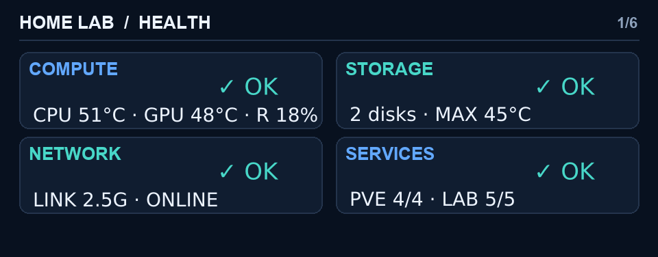</a> 
      <small><em><strong>Health</strong> 
      Compact state of Compute, Storage, Network and Services.</em></small>  
    </td>
    <td width="50%" align="center">
      <a href="compute.png">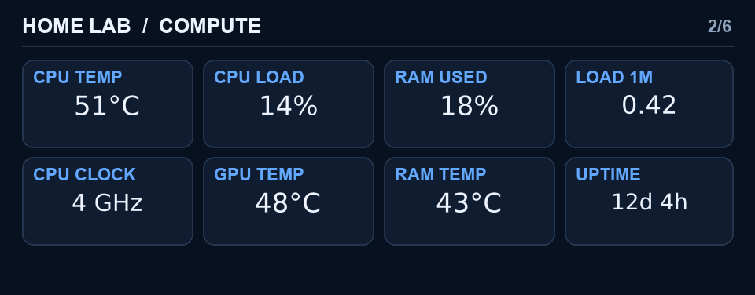</a> 
      <small><em><strong>Compute</strong> 
      CPU, GPU, memory, load, clocks and uptime.</em></small>  
    </td>
  </tr>
  <tr>
    <td width="50%" align="center">
      <a href="gpu.png">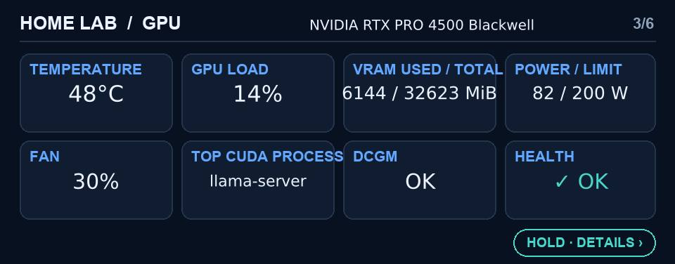</a> 
      <small><em><strong>NVIDIA GPU</strong> 
      Live temperature, load, VRAM, power, fan, workload and health.</em></small>  
    </td>
    <td width="50%" align="center">
      <a href="gpu-details.png">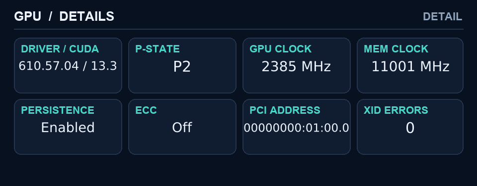</a> 
      <small><em><strong>GPU details</strong> 
      Driver, CUDA, clocks, persistence, ECC, PCI address and Xid errors.</em></small>  
    </td>
  </tr>
  <tr>
    <td width="50%" align="center">
      <a href="storage.png">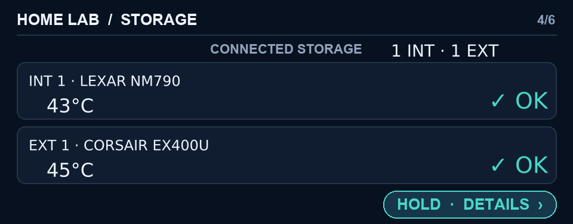</a> 
      <small><em><strong>Storage</strong> 
      Adaptive internal/external device layout.</em></small>  
    </td>
    <td width="50%" align="center">
      <a href="network.png">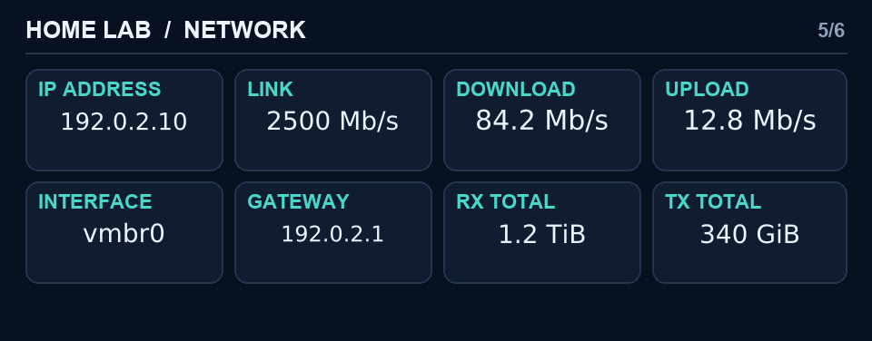</a> 
      <small><em><strong>Network</strong> 
      Link, live throughput, interface, gateway and traffic totals.</em></small>  
    </td>
  </tr>
  <tr>
    <td width="50%" align="center">
      <a href="services.png">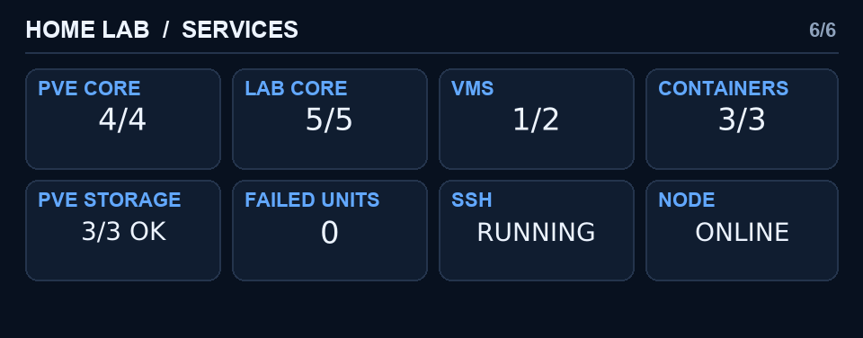</a> 
      <small><em><strong>Services</strong> 
      Proxmox, dashboard services, guests, storage, SSH and node state.</em></small>
    </td>
    <td width="50%"></td>
  </tr>
</table>

  

## Storage details

<table>
  <tr>
    <td width="50%" align="center">
      <a href="storage-lexar-details.png">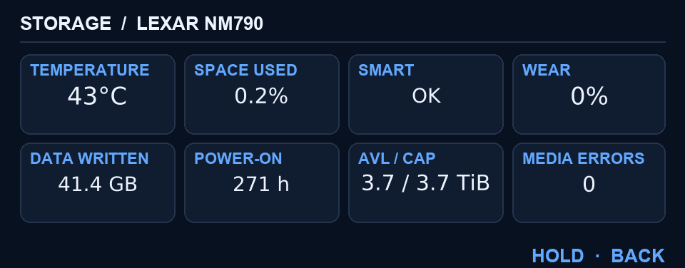</a> 
      <small><em><strong>Internal NVMe</strong> 
      SMART, wear, written data, hours, AVL/CAP and media errors.</em></small>
    </td>
    <td width="50%" align="center">
      <a href="storage-corsair-details.png">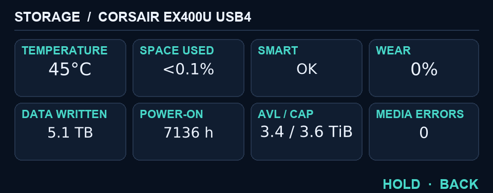</a> 
      <small><em><strong>External USB4/NVMe</strong> 
      Filesystem availability plus native NVMe health information.</em></small>
    </td>
  </tr>
</table>

  

## Health-state language

<table>
  <tr>
    <td width="50%" align="center">
      <a href="health-warning.png">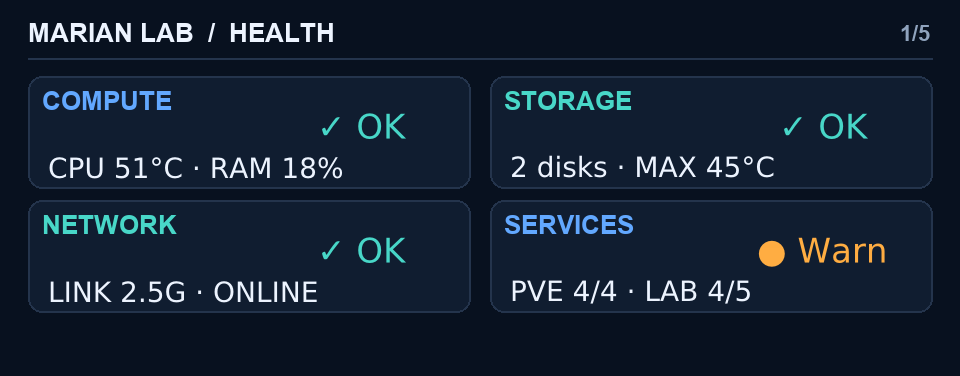</a> 
      <small><em><strong>Warn</strong> Fixed amber dot.</em></small>
    </td>
    <td width="50%" align="center">
      <a href="health-error-on.png">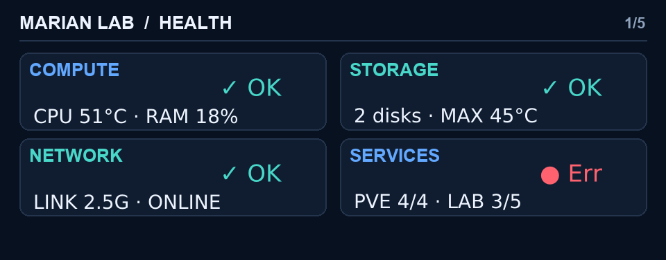</a> 
      <small><em><strong>Err — pulse on</strong> Red dot visible.</em></small>
    </td>
  </tr>
</table>

  

## Guarded System Actions

The physical Power button opens this private modal; it is not part of normal
dashboard rotation. Tap changes the selection, hold confirms, and the menu
cancels after five seconds without input.

<table>
  <tr>
    <td width="50%" align="center">
      <a href="system-actions-reboot.png">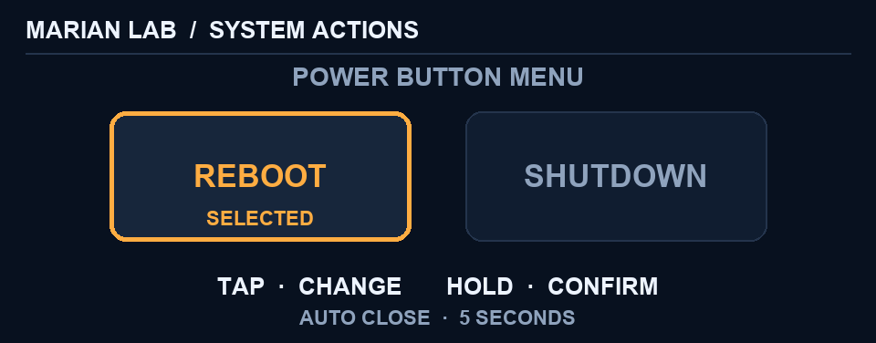</a> 
      <small><em><strong>Reboot selected</strong></em></small>
    </td>
    <td width="50%"></td>
  </tr>
</table>

See the [project README](../README.md) for architecture, build instructions,
safety notices and the Human–AI collaboration disclosure.
