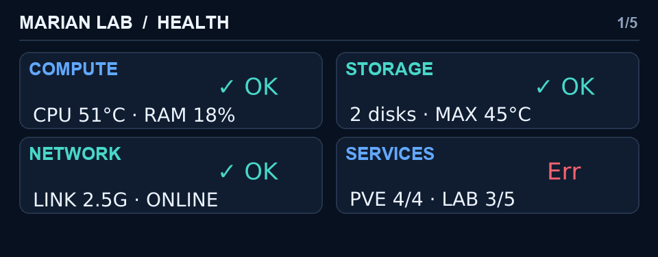

#Dashboard Gallery

Renderer-generated captures at the native LCD resolution of **960×376**. All
values are synthetic or anonymized documentation fixtures; no private host IP,
disk serial number or personal workload data is shown.

Click any panel to open the full-resolution image.

## Main dashboard

<table>
  <tr>
    <td width="50%" align="center">
       
      <strong>Health</strong> 
      Compact state of Compute, Storage, Network and Services.
    </td>
    <td width="50%" align="center">
       
      <strong>Compute</strong> 
      CPU, GPU, memory, load, clocks and uptime.
    </td>
  </tr>
  <tr>
    <td width="50%" align="center">
       
      <strong>Storage</strong> 
      Adaptive internal/external device layout without empty placeholders.
    </td>
    <td width="50%" align="center">
       
      <strong>Network</strong> 
      Link, live throughput, interface, gateway and traffic totals.
    </td>
  </tr>
  <tr>
    <td width="50%" align="center">
       
      <strong>Services</strong> 
      Proxmox, MARIAN LAB, guests, storage, SSH and node state.
    </td>
    <td width="50%"></td>
  </tr>
</table>

  

## Storage details

<table>
  <tr>
    <td width="50%" align="center">
       
      <strong>Internal NVMe</strong> 
      SMART, wear, written data, hours, AVL/CAP and media errors.
    </td>
    <td width="50%" align="center">
       
      <strong>External USB4/NVMe</strong> 
      Filesystem availability plus native NVMe health information.
    </td>
  </tr>
</table>

  

## Health-state language

<table>
  <tr>
    <td width="33%" align="center">
       
      <strong>Warn</strong> Fixed amber dot.
    </td>
    <td width="33%" align="center">
       
      <strong>Err — pulse on</strong> Red dot visible.
    </td>
    <td width="33%" align="center">
       
      <strong>Err — pulse off</strong> Text remains readable.
    </td>
  </tr>
</table>

  

## Guarded System Actions

The physical Power button opens this private modal; it is not part of normal
dashboard rotation. Tap changes the selection, hold confirms, and the menu
cancels after five seconds without input.

<table>
  <tr>
    <td width="50%" align="center">
       
      <strong>Reboot selected</strong>
    </td>
    <td width="50%" align="center">
       
      <strong>Shutdown selected</strong>
    </td>
  </tr>
</table>

See the [project README](../README.md) for architecture, build instructions,
safety notices and the Human–AI collaboration disclosure.
